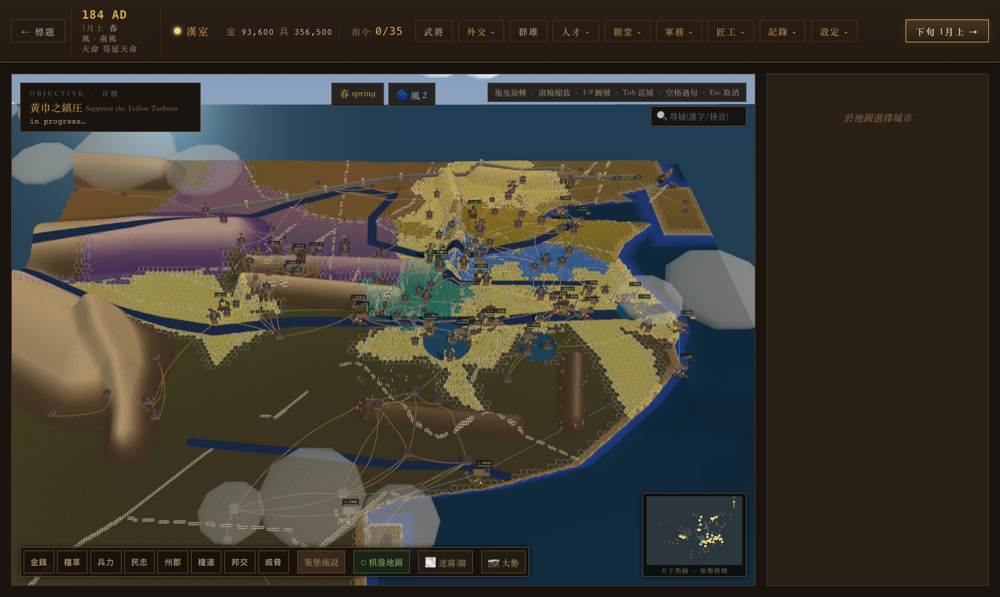
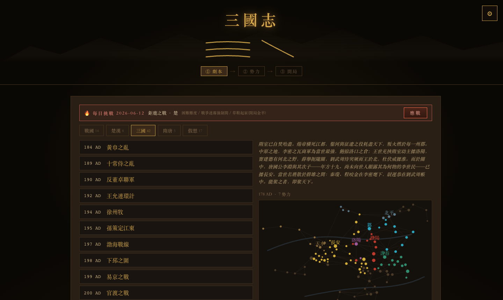

# 三國志大師 · Three Kingdom Masters

仿《三國志》(RTK II–IV / 14)風格的瀏覽器大型戰略遊戲 —— 一張地圖,從天下大勢一路放大到城內街巷與戰場單格。純前端,免安裝,離線可玩。

**▶ 立刻遊玩 / Play now:**
**https://seanye333.github.io/three-kingdom-masters/**

手機可裝成 App:iOS Safari 分享 → 添加到主屏幕;Android Chrome 菜單 → 安裝應用。全屏、離線、進度自動保存。



## 玩法一覽

- **一世界三鏡頭** — 大地圖 / 城內 / 戰場是同一個世界:戰鬥就在它發生的那塊土地上以立體微縮打響,可原地指揮,也可一鍵進全屏戰場
- **真歷史開局** — 184 黃巾之亂起的多個劇本、數百名史實武將(數值/字/生卒/列傳俱全),歷史事件鏈帶選擇分支:三顧茅廬去不去三次,你說了算
- **完整內政軍政** — 農商防徵、市易糧價、義倉醫館堤防防災、委任太守自動施政、軍團都督代打一個方向、全軍集結令
- **戰場縱深** — 六角戰棋、陣形、計謀、武將單挑、火計借東風(風向真的會轉)、戰前伏兵/夜襲/地道、攻城器械與城防設施
- **天下棋局** — 外交(同盟/聯姻/人質/歲貢)、奉迎天子挾天子以令諸侯、諜報細作、戰爭迷霧、烽火台預警、糧道補給
- **長線收集** — 跨戰役武將圖鑑(五虎將成套點亮)、勳功成就、武將列傳由你的戰役親筆寫成、每日挑戰全網同題
- **Mod 友好** — 一個 JSON 就能加自製武將與事件;存檔一鍵導出/導入跨設備接著玩



## 技術

React 19 + TypeScript + Vite · three.js / react-three-fiber(全 3D)· zustand(狀態+持久化)· PWA(離線)· 音樂音效全程 Web Audio 合成,零素材文件 · 310+ 單元測試 + Playwright E2E

```bash
npm install
npm run dev        # 開發
npm test           # 單元測試
npm run test:e2e   # 冒煙測試
npm run build      # 生產構建
npm run tauri:dev  # 桌面版(需 Rust,見 src-tauri/README.md)
```

每次 push 到 `main` 自動部署 GitHub Pages 與 Vercel。

## License

Personal project — all rights reserved. 歷史人物與事件屬於公共領域;遊戲代碼與文案版權所有。
