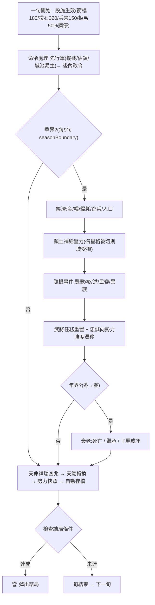
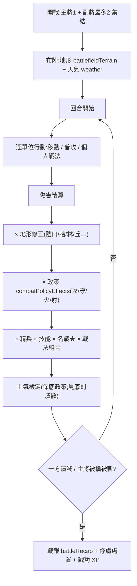
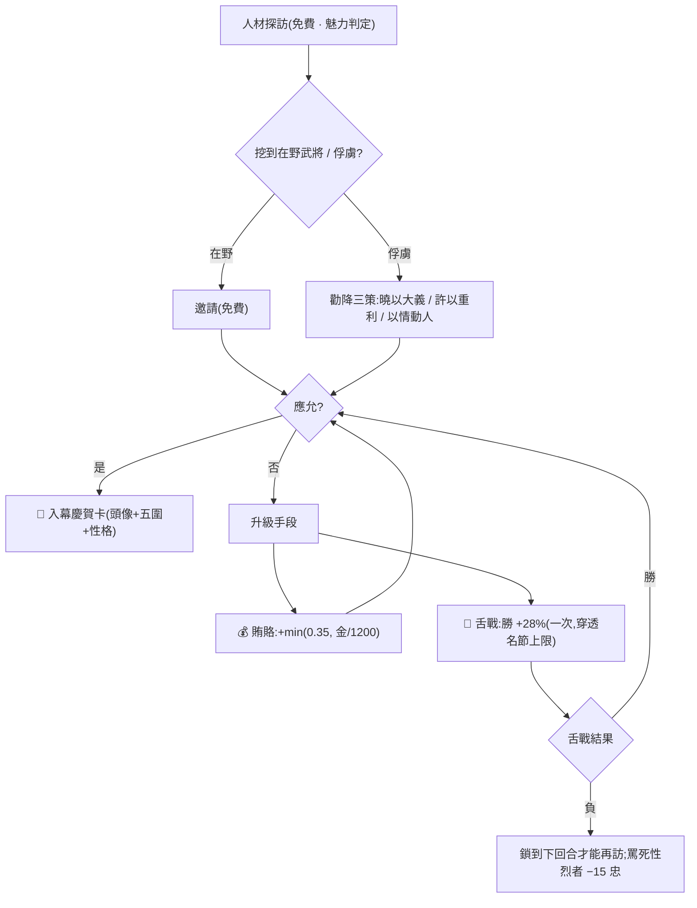
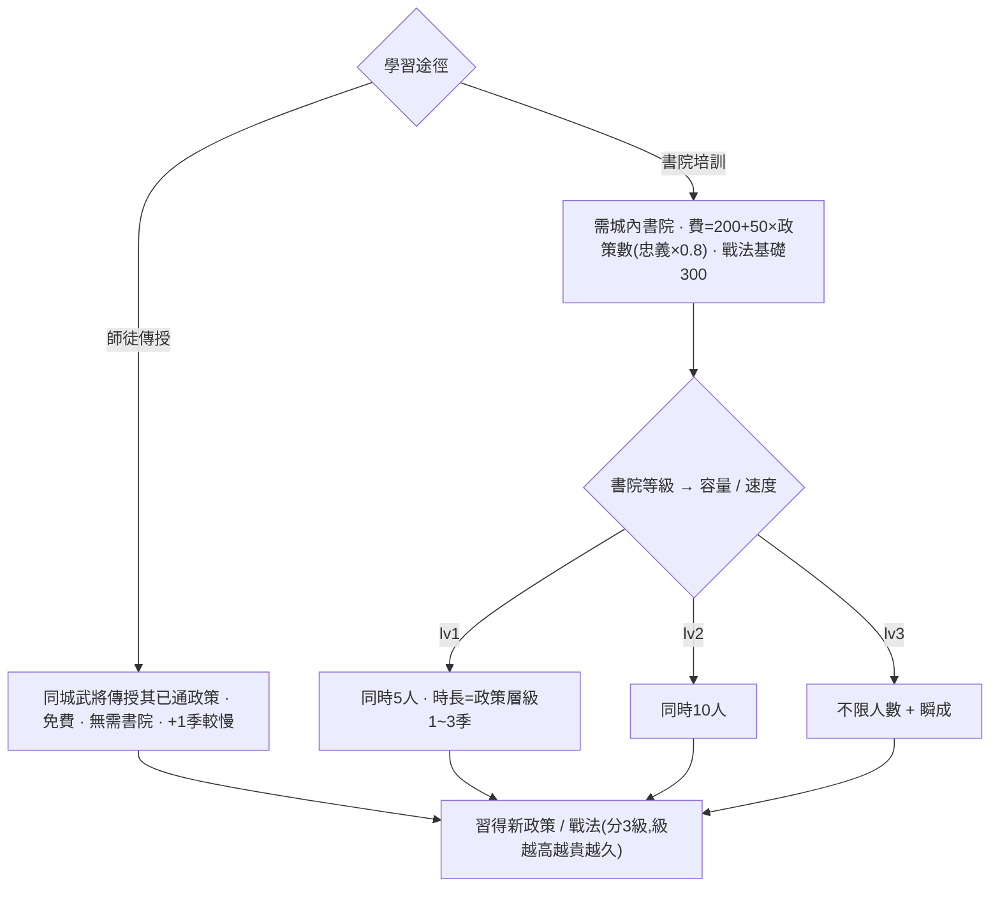
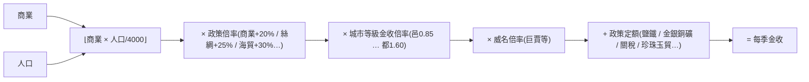

# 三國志大師 · 全功能攻略與設計文檔

> 一份「真相源」:既是玩家攻略(怎麼玩),也是設計/數值文檔(每個數字是多少)。
> 所有數值以 `src/game/` 代碼為準;改了機制請同步更新本文。
> 全十一章 + 流程圖 + 附錄已成 ✅。新增/改動機制時請同步更新對應章節。

---

## 目錄(所有遊戲內容地圖,72 個系統)

| # | 章節 | 涵蓋系統 | 狀態 |
|---|---|---|---|
| 1 | [城市・內政・經濟](#第一章-城市內政經濟) | citySize, economy, commands, market, buildings, autoBuild, policyEffects, forging, growth | ✅ |
| 2 | [武將・成長・家族](#第二章-武將成長家族) | officerFate, traitEffects, personality, biography, posthumous, aging, family, retinues, wishes, rapport, relationshipEffects, career, codex | ✅ |
| 3 | [人才・招攬・舌戰](#第三章-人才招攬舌戰) | commands(search), officerFate, debate, wordWar, commonerTalent | ✅ |
| 4 | [軍事指揮・委任](#第四章-軍事指揮委任) | muster, legion, governor, advisor | ✅ |
| 5 | [戰術戰鬥](#第五章-戰術戰鬥) | tactical, combat, formations, stratagems, weather, battlefieldTerrain, personalTactics, weaponTypes, namedMaps, damagePredict, battleRecap, fogOfWar | ✅ |
| 6 | [單挑](#第六章-單挑) | duel, gauntlet | ✅ |
| 7 | [外交・謀略・天子](#第七章-外交謀略天子) | diplomacy, coalition, schemes, espionage, intrigue, emperor, imperialEffects, mandate, courtFactions, appointmentEffects | ✅ |
| 8 | [事件・天命・異族・宗教](#第八章-事件天命異族宗教) | events, historicalEvents, customEvents, factionEvents, religion, tribes | ✅ |
| 9 | [元遊戲・收藏・分享](#第九章-元遊戲收藏分享) | achievements, deedTitles, dailyChallenge, leaderboard, mods, powerHistory, historyBook, sound, voiceLines, dialogueRoll | ✅ |
| 10 | [AI](#第十章-ai) | ai, aiBuild, aiCourt, aiAppointments, aiWishesFlavor | ✅ |
| 11 | [核心流程・勝敗・培訓・其他模式](#第十一章-核心流程勝敗培訓其他模式) | resolution, endings, training, succession, objectives, hotSeat, spectator, heroMode, customOfficer, eventEditor, randomScenario, dynasties | ✅ |
| 圖 | [流程圖 Flowcharts](#流程圖-flowcharts) | 核心循環視覺化:結算順序 / 戰鬥管線 / 招攬升級 / 培訓 / 金收公式 | ✅ |

---

## 第一章 城市・內政・經濟

### 1.1 城市等級(citySize.ts)

城市等級**純看人口、實時自動升降**,不需手動、不花錢。

| 等級 | 人口門檻 | 農商上限 econCap | 防御上限 statCap | 兵力上限 | 金收倍率 | 糧收倍率 | 建築格 |
|---|---|---|---|---|---|---|---|
| 邑 Hamlet | 0 | 90 | 60 | 8,000 | ×0.85 | ×0.85 | 4 |
| 鎮 Town | 30,000 | 140 | 80 | 20,000 | ×1.00 | ×1.00 | 6 |
| 城 City | 80,000 | 190 | 100 | 40,000 | ×1.15 | ×1.15 | 8 |
| 大城 Large | 160,000 | 250 | 130 | 70,000 | ×1.35 | ×1.30 | 10 |
| 都 Capital | 280,000 | 320 | 160 | 120,000 | ×1.60 | ×1.50 | 12 |

- 升「城」(8 萬)解鎖二級內政:大農政、大商政、大築城、城壁強化。
- `loyaltyCap` 恒為 100。

### 1.2 季度收支(economy.ts,每季結算一次)

- **金收** = ⌊商業 × (人口 / 4000)⌋ × 政策倍率 × 等級金收倍率 × 威名倍率 + 政策定額
  - 例:商業 25、人口 10 萬 → 25 × 25 = 625 金/季(邑級再 ×0.85)。
  - **+1 商業 ≈ +(人口/4000) 金/季**(10 萬人口 ≈ +25 金/季)。
- **糧收**(僅秋季) = ⌊農業 × (人口 / 1000)⌋ × 等級糧收倍率 + 義倉額外糧。
- **糧耗** = ⌈兵力 × 0.25⌉ /季。糧不足 → 逃兵(缺多少糧按 0.25/兵折算開小差)。
- **人口增減**(僅秋季):民忠高 + 糧有盈餘 → 增長;反之萎縮。升級全靠人口,故「囤糧 + 保民忠 + 招撫流民」是升城三件套。

### 1.3 內政命令(commands.ts)

每名武將每季可下一道令。增益 = `⌊有效屬性/20⌋ + 1 + 隨機(0~2)`,有效屬性 = 武將屬性 × 性格契合 × 官職加成。

| 命令 | 費用 | 屬性 | 上限 | 等級要求 | 說明 |
|---|---|---|---|---|---|
| 農業開発 | 300 | 政治 | econCap | — | 勸農,提升秋收糧 |
| 商業開発 | 300 | 政治 | econCap | — | 興商,提升金收 |
| 城壁修築 | 400 | 政治 | statCap | — | 提升城防,守城減損 |
| 徴兵 | 500 | 魅力 | 兵力上限 | — | 徵募,耗人口(每兵 −2 人口) |
| 民忠安撫 | 200 | 魅力 | 100 | — | 提升民忠 |
| 人材探訪 | **0** | 魅力 | — | — | 免費!成功率 = 魅力/100(封頂85%) |
| 招撫流民 | 400 | 魅力 | — | — | 直接加人口 → 推動升城 |
| 鎮守 | 150 | 統率 | — | — | 驅逐外圍敵軍 + 城防小增 |
| 大農政 | 800 | 政治 | econCap | 城+ | 3× 勸農 |
| 大商政 | 800 | 政治 | econCap | 城+ | 3× 興商 |
| 大築城 | 1000 | 政治 | statCap | 城+ | 3× 築城 |
| 城壁強化 | 1500 | 政治 | wallTier 1→3 | 城+ | 城牆層級,T2 +18% / T3 +40% 守備 |
| 出陣 | 100 | 統率 | — | — | 行軍至鄰城 |

- **性格契合**:⭐ 相宜(≥1.15× 加成)/ ⚠ 相剋(≤0.85× 折扣)。派對性格的人。
- **政治分檔**:20 一檔(政治 80 與 60 同基礎值),頂級文官優勢有限。
- **選將可多選**:一次勾多員一起委派,人材探訪免費可全城齊出。

### 1.4 城內理政入口(城內 3D 地圖)

進城點對應建築即可下令、當場看數值:

- **屯田 田畝** → 勸農 / 大農政(顯示 農業 X/econCap)
- **市集 商坊** → 興商 / 大商政(顯示 商業 X/econCap)
- **府衙 治所** → 民忠安撫 / 招撫流民
- **兵營 校場** → 徵兵
- **酒樓** → 人材探訪
- **城牆 城門** → 城壁修築 / 城壁強化

大地圖選中城池的指令面板同樣能下所有令(兩個入口並存)。

### 1.5 市易(market.ts)

城內「市易」金糧互市,匯率 = 每金可換糧數,範圍 4~22:

- 季節:秋 ×1.3(穀賤)、冬 ×0.7(穀貴)、春 ×0.95、夏 ×1.05。
- 缺糧之城(存糧 < 兵×2)價漲(×0.6);糧倉滿溢(> 兵×8)價跌(×1.25)。
- 商業越高匯率越好(+商業/400)。
- 雙向抽一成(10% spread),來回倒手必虧 —— 要靠真實價差套利。
- **實戰**:秋天賣餘糧換金,是前期最大的隱藏現金來源。

### 1.6 城市建築(buildings.ts,城內 3D 自建)

在空地基上建造,每級乘法加成(與默認地標建築分開):

| 建築 | 效果 |
|---|---|
| 兵營 | 徵兵速度 +10%/級、兵力上限 +5%/級 |
| 市場 | 商業金收 +12%/級(最高 +60%) |
| 鐵工坊 | 徵兵 +8%、商業 +3% /級;鍛造前置 |
| 書院 | 武將培訓、招攬機率 |
| 寺院 | 民忠 + 抗離間 |
| 屯田(農場) | 秋收糧 |
| 城壁 | 城防 |
| 船渠 | 造船前置(限臨水城) |
| 義倉 🆕 | 饑荒 −20%/級、糧損 −25%/級 |
| 醫館 🆕 | 瘟疫 −25%/級(發生與死傷) |
| 堤防 🆕 | 洪災 −1/3/級,三級免疫 |

> 乘法建築(市場/義倉等)長期碾壓「硬戳」內政;發展到中期應優先補關鍵建築。

### 1.7 缺錢自救清單(實戰速查)

1. 秋天 **市易賣糧** 換金。
2. 富城 **蓋市場**(+12%/級複利)。
3. **委任太守** 自動施政,省手動花費。
4. **攻城掠金**:打下敵城得其國庫。
5. **巨賈/能臣** 威名武將駐錢城(+6~15% 收入)。
6. **人材探訪免費** + 多選,別省這一步。

### 1.8 鍛造合成(forging.ts,14 配方)

在建有 **鐵工坊**(foundry)的城,花金 + **獻祭已有名品**,按配方鍛出更強的指定名品(store `forgeItem`)。

- **材料**:配方所需名品須在該城的「藏寶池」(失落名品池)裡;鍛成後消耗材料,新名品入池,城中任一武將可裝備。
- **工坊門檻**:配方分 lv1~3,鐵工坊(每級 500 金 / 3 季 / 上限 4 級)須達標等級才能開鍛。
- **代表配方**(共 14):

| 成品 | 金 | 工坊級 | 材料 |
|---|---|---|---|
| 玄甲 | 600 | 1 | 鎖子連環甲 |
| 孟德新書 | 600 | 1 | 孫子兵法 |
| 八卦戟 | 800 | 2 | 寒月刀 + 蟠龍棍 |
| 七星燈 | 900 | 2 | 太極圖 + 玉璧 |
| 諸葛連弩 | 1200 | 3 | 連弩 + 烏金弓 |
| 青龍偃月刀 | 2000 | 3 | 鳳嘴刀 + 開山斧 |
| 方天畫戟 | 2500 | 3 | 骨穿雙戟 + 雙鐵戟 |

> 用途:把開局散落、屬性平庸的雜兵器熔成關羽/呂布級神兵 —— 神兵不再只能靠探訪挖到,有錢有工坊就能自己造。

---

## 第二章 武將・成長・家族

### 2.1 五圍與成長(growth.ts)

- 五圍:**統率**(行軍/守城)、**武力**(單挑/戰場殺傷)、**智力**(計謀/用間/識破)、**政治**(內政增益)、**魅力**(招攬/徵兵/民忠)。
- **潛能 latentStats**:每人有隱藏資質,成長以此為天花板;`STAT_CAP = 150`(遠高於起始數值,留足上升空間)。
- **經驗 XP → 等級**:升級門檻 `[100, 250, 500, 900, 1500, 2500]`(共 6 級)。升級時向潛能靠攏:`新值 = min(150, 當前 + max(8, ⌊(150−當前)×25%⌋))` —— 越接近潛能漲得越慢,但每次至少 +8。
- **XP 來源**:打仗(awardBattleXp)、培訓、內政成功等;高 XP 武將會自然習得性格與技能。

### 2.2 性格 traits(personality.ts,共 200 條定義)

- 每人 0~3 條性格,驅動 AI 傾向、事件鉤子與各系統加成。
- **內政契合**(traitEffects):勤勉 +20%、怠惰 −20%、專精類別 +20%… 在選將面板顯示 ⭐(相宜 ≥1.15×)/ ⚠(相剋 ≤0.85×)。
- **招攬難度**:貪婪/野心/怯懦等易策反;忠義/高潔/愛國/廉潔/鐵骨等極難(見第三章)。
- **壽數**:某些性格影響死亡機率(deathChanceMultiplier)。
- **舌戰崩潰**:性烈者(暴躁/傲慢/虛榮/剛愎)氣勢被打穿時可被「罵死」(見第六章)。

### 2.3 衰老與死亡(aging.ts,每年冬末結算)

- **史實武將**:在 `deathYear` 前不死;之後每年死亡機率 `min(1, 0.3 + (當年−卒年)×0.15)` —— 卒年當年 30%,逐年 +15%,約幾年內必逝。卒年前後波動,可能改寫歷史。
- **虛構/子嗣武將**:60 歲前不死;之後每年 `(歲−60)×0.05`(70 歲 50%)。
- **諡號**:在職病逝者獲朝廷追諡(見第九章 codex/posthumous 速覽)—— 名將用史諡(關羽壯繆侯),餘者依諡法按生平定名。
- **絕命詩**:部分名將身故附絕命詩。
- **君主之死 → 繼承**(succession.ts):君主亡則由同勢力最高魅力武將繼位;無人則勢力可能瓦解。

### 2.4 家族與子嗣(family.ts)

- **聯姻**:可在外交面板為自家武將與他方武將締姻(或府內結親),兩家好感大增、忠誠穩固。
- **生育 → 子嗣**:配偶會誕下子嗣(pendingHeirs),`COMING_OF_AGE = 14` 歲成年自動出仕,加入父輩勢力。
- **資質遺傳**:子嗣五圍取雙親均值加噪聲;**潛能 = 起始 +25**(min 150),5% 機率出「神童」暴漲 —— 養成名門世家、打穿八十年世代傳承的核心。
- **喪親之痛**:武將身故,與其結義/血親者忠誠受挫(griefOnDeath)。

### 2.5 好感與義結(rapport.ts / relationshipEffects.ts)

- **好感 rapport**(0~100):靠社交行動培養。
- **社交命令**:結交(`socializeOfficers`,+25 好感/次)、宴請(全城武將互增好感+提民忠)、贈禮等。
- **義結 OathBond**:一對武將好感達 `RAPPORT_BOND_THRESHOLD = 100` 自動結為兄弟 —— 戰場並肩有 bondBonus 戰力加成、不易相互背叛。
- **既有羈絆**:義兄弟、師徒、宿敵、私仇、戀人、主従、家族關係,影響招攬機率、戰力、事件。
- **自然結義**:同城/同軍共事的武將每季有機率自發結義(recentBonds 提示)。

### 2.6 列傳與圖鑑(交叉引用)

- **武將列傳**(biography.ts):武將詳情頁的「本朝實錄」由本局戰績/成名之戰/稱號自動生成(見第九章)。
- **武將圖鑑**(codex.ts):跨戰役收藏冊 —— 遇/仕/斬三檔,五虎將等成套點亮(見第九章)。

### 2.7 武將生涯(career.ts)

- 開局可選一名武將為主角,以個人視角經歷生涯;配合「永久死亡」設定,主角身故即終局。

### 2.8 部曲(retinues.ts,32 位君主)

許多二線軍閥史實上統領十餘將,但劇本裡常以孤身君主登場、舊部散落在野。**部曲表**按**君主 id** 綁定其歷史班底;開局時 `fillRetinues` 把名單上的舊部召入麾下 —— 前提是該將在此劇本存在、當年在世、且尚未事他主。

- 例:呂布 → 陳宮、高順、張遼、臧霸…;劉表 → 蔡瑁、蒯越、黃祖、文聘…;馬騰 → 馬超、馬岱、龐德、韓遂…;孫堅 → 程普、黃蓋、韓當、孫策。
- **改換門庭者**(趙雲 公孫瓚→劉備、張遼 呂布→曹操、馬超/法正 劉璋/馬騰→劉備)可掛在多位君主名下;以**已手動指派的後手君主優先**,確保史實歸屬正確。
- 意義:小軍閥開局不再光桿司令,陣容貼史實,也讓「先打誰能撿到名將」多了一層盤算。

### 2.9 武將心願(wishes.ts)

自家武將每季有小機率上書陳情(忠誠 ≥95 者不會開口):求升遷、求賞賜等。

- **應允** → 忠誠 +8~14(依心願類型);**駁回** → 忠誠 −4~12;**置之不理(逾期)** → 較小的忠誠折損(怠慢之過,比明駁輕)。
- 野心/傲慢者更常開口求官。把心願當成低成本的忠誠維護 —— 順手應允通常比事後補救划算。(AI 勢力同理,旁白見第九章 aiWishesFlavor。)

---

## 第三章 人才・招攬・舌戰

### 3.1 人才從何而來

1. **開局藏於城中**:每件武將/名品開局散在城裡(歷史/虛構模式),靠探訪揭露。
2. **人材探訪**(免費,魅力判定):成功時先 35%+(智力>60 每點 +0.5%)挖到該城藏的名品,否則發現一名在野武將(優先本城出身)。
3. **求賢令出寒門**:發布「求賢令」敕令的勢力,生效期間每季 35% 機率自四方來投一名生成的庶民武將(35~70 五圍,12% 暗藏明珠,忠誠 80)。
4. **子嗣出仕**(見第二章)。

### 3.2 在野招攬(訪賢,officerFate.ts)

- **邀請免費**(AI 招募仍按自己錢袋)。成功率 = (君主魅力+20)/100,疊加性格、出身、威名、君主性格、羈絆加成,高潔者 −10%。
- **婉拒後升級**:
  - **💰 賄賂**(300 金):加 `min(0.35, 金/1200)` 成功率。
  - **💬 舌戰**:派最善言武將與其論辯,**勝則 +28%**(一次),負則該武將**鎖到下回合**才能再訪。
- 成功彈出**入幕慶賀卡**(頭像+五圍+性格)。

### 3.3 勸降俘虜(三策,officerFate.ts)

俘虜面板對每名捕虜可選三種勸降,實時顯示成功率:

| 策 | 機制 |
|---|---|
| 曉以大義 | 忠義之士抵抗減半,放棄一切貪利開口,**唯一能動名節之士**;高潔上限 0.15→0.35 |
| 許以重利 | 費用加倍,加定額;貪者心動,廉者(廉潔/寡欲/玉心/高潔/重義)倍怒 |
| 以情動人 | 換算「俘虜與你麾下最高好感」為機率,鄉土加成加倍 |

- **💬 舌戰** 同樣可先打:勝則勸降 +28%(穿透名節上限);**罵死** 性烈俘虜時其志氣再挫(−15 忠誠)。

### 3.4 舌戰(debate.ts / wordWar)

- 四張論點牌相剋環:**曉以大義 → 激將罵陣 → 據理折服 → 詭辯機鋒 → (回到大義)**。
- 傷害隨「口才」(智力×0.7 + 魅力×0.3)縮放;**剋者傷 ×1.6,被剋傷 ×0.5**;對手智力越高越會反制你重複的牌。
- 氣勢(100)見底者認負;**性烈者(暴躁/傲慢/虛榮/剛愎)被打穿至深負 → 罵死**(諸葛罵死王朗)。
- 用途:在野招攬、俘虜勸降的升級手段。

---

## 第四章 軍事指揮・委任

### 4.1 出陣與行軍

- 出陣(100 金)派武將率兵赴鄰城;水路經港口可達非鄰城(漕運,兩季)。
- 主將 1 + 副將最多 2;行軍按地形距離算旬數(100/195/275 px ≈ 1/2/3 旬)。
- 大地圖選中縱隊顯示 1/2/3 旬可達圈,懸停他城顯示改道旬數。

### 4.2 全軍集結令(muster.ts)

一鍵令所有「駐軍 ≥3000、有閒將、付得起軍費」的城向目標進發:鄰城直撲,腹地沿不出國境的最短路徑走一跳;最強閒將領七成兵力。

### 4.3 軍團都督(legion.ts)

劃一組城 + 一名都督 + 方略,軍團每旬自行運作:
- **攻略(目標城)**:守軍補到 ≥3000(不足則徵兵),≥6000 餘力的城投 65% 兵向目標(鄰城直撲/腹地一跳)。
- **固守**:最強城增援危急的瘦弱鄰城。
- 失城/忙碌武將自動跳過。內政請配合委任太守。

### 4.4 委任太守(governor.ts)

把城交給太守,每旬自動下一道內政令(走正常管線、計費、占用武將):先平亂 → 武職太守先補瘦弱守軍 → 否則發展最弱的一項(農/商/低城防)→ 國庫不足則跳過。

### 4.5 軍師錦囊(advisor.ts)

最高智武將每旬讀盤獻三策(城將失守→徵兵、民亂→安撫、缺糧→市易買糧、穀豐金荒→賣糧、賢才在野→探訪、良將閒置→派活、鄰城空虛→提示),可下令的一鍵「照辦」。

---

## 第五章 戰術戰鬥

### 5.1 戰場(tactical.ts / combat.ts)

- 六角棋盤(攻城 18×12;野戰/水戰尺寸不同),武將為單位、麾下兵為血量。
- **時辰**:晝/夜/拂曉/黃昏 —— 夜戰弓弩射程縮至 2、伏擊加成更高、整體夜戰修正。
- **行動點 AP**:騎兵 4、步弓 3、攻城 2。移動/攻擊/施計各耗 AP。
- **微縮在地圖原地開打**,可原地指揮(移動/攻擊/計謀/結束回合),或 ⤢ 進全屏。

### 5.2 陣形(formations.ts,10 種)

無陣、魚鱗、八陣、鋒矢、鶴翼、散開、錐行、車懸、方圓、偃月 —— 各有攻/守/機動側重與剋制關係。

### 5.3 計謀(stratagems.ts,18 種)

火計、混亂、突擊、防御、鼓舞、亂射、連環計、詐退、先見、落雷、糧道急襲、疾走、龍隱、撞城、跳幫、火船、劫糧、落石…。智力門檻 + 冷卻;名將簽名戰法(借東風/草船借箭/八門遁甲…)更強更稀有。

### 5.4 天氣與火攻(weather.ts)

- 天氣:晴/雨/雪/風/旱,各帶風向與風力,隨季節分佈。
- **火**:雨澆滅、風助長;**風向決定火勢蔓延方向**。
- **借東風**:祭風成功 → 戰場天氣轉風、風從施法者吹向敵陣,使後續火攻燒進敵軍。
- **水戰**:每輪 15% 風向轉向;連環計 + 火船 + 東風 = 赤壁成局。

### 5.5 城防設施(battlefieldTerrain / facilities)

大地圖在城郊築箭樓/投石臺/陣/防壁,每季轟擊/補給/攔阻路過敵軍,開戰時出現在戰場參戰;城內 8 方位可布城防,可「守城演習」練兵(不損兵將)。

### 5.6 戰前準備(每方一張,turn 1)

- **伏兵**:最強非主將隱形(首擊伏擊加成)。
- **夜襲**:開局入夜(弓弩射程縮短)。
- **地道**(攻城方限):最弱一軍直接出現在牆內。

### 5.7 戰場輔助

- **戰爭迷霧**(fogOfWar,可開關):只見自家城+一跳、行軍縱隊沿途;細作開眼揭敵城一季。
- **傷害預估**(damagePredict):攻擊前預覽傷害。
- **戰後復盤**(battleRecap):戰損比、最堅韌、中流砥柱、計謀次數。
- **委託指揮**:小仗一鍵交戰術 AI 代打。
- **戰鬥錄影**:🎬 導出 WebM。

### 5.8 兵裝(weaponTypes.ts,10 類)

每名武將有一個**兵裝類型**,由其裝備的主武器衍生(RTK14 風格;目前純展示,留有未來戰鬥加成鉤子):

> 槍兵 / 戟兵 / 刀兵 / 劍士 / 弓兵 / 弩兵 / 騎兵 / 兵器 / 軍師 / 徒手(共 10 類)

- **判定順序**:先取裝備中的主武器(丈八蛇矛→槍、青龍偃月刀→刀、羽扇→軍師…);無特定武器則按屬性推:智 ≥88 且武 <70 → 軍師;裝備有馬 → 騎兵;武 ≥80 → 槍、≥70 → 刀、≥60 → 弓;否則徒手。

### 5.9 預設戰場(namedMaps.ts,18 張)

對特定名城開打時,改用**手工設計的戰場**(地形 / 天氣 / 特殊格)覆蓋程序生成:

> 赤壁、虎牢關、長坂橋、五丈原、官渡(烏巢糧倉)、麥城、樊城(漢水堰)、定軍山、街亭… 共 18 張。

- 例:**赤壁**固定起風、黃昏,一條斜貫的長江把南北軍隔開,設橋與渡口 —— 只有南風能成全火攻,還原史實戰場的勝負手。

---

## 第六章 單挑

- **互動單挑**(duel.ts):攻/守/計/奮 四式相剋(守>攻>計>守;奮剋攻與計、敗於守),氣力為血量,守成功積「氣」放奮擊。
- **罵陣**:開打前一次,武力+魅力壓過對手則蓄一記奮擊,反之自損 12 氣力。
- **車輪戰**(gauntlet.ts):一將對一隊挑戰者,中間不休整 —— 攜帶氣力 + 疊加疲勞(每場 −8 武力,封頂 −30),三英可耗死呂布。
- 勝負受武器/馬匹/技能/威名加成(staticProwess)。

---

## 第七章 外交・謀略・天子

### 7.1 外交(diplomacy.ts)

- 關係狀態:中立 / 互不侵犯 / 同盟;好感 −100~+100。
- 行動:同盟、互不侵犯(臨時和平)、歲貢(+好感)、聯姻、送質子(+50 好感、16 季 NAP)、破盟(−50)。

### 7.2 計略(schemes.ts,勢力級)

| 計 | 費用 | 效果 |
|---|---|---|
| 驅虎吞狼 | 600 | 甲乙交惡(−50)+ 甲得 2 年討伐令(+10% 對乙戰力) |
| 二虎競食 | 800 | 相鄰兩強交惡(−30)+ 互得討伐令 |
| 遠交近攻 | 300 | 與無接壤之國交好(+25) |

成算看軍師智力,敵對越深越易得手;施計**勝負都扣金**。officer 級「離間」在諜報。

### 7.3 諜報(espionage.ts)

| op | 費用 | 效果 |
|---|---|---|
| 諜報 gather-intel | 80 | 情報 + 細作開眼 |
| 煽動 instigate | 250 | 敵城民忠跌 |
| 破壞 sabotage | 200 | 毀敵存糧 |
| 暗殺 assassinate | 500 | 刺殺敵將 |
| 寢返 defect | 400 | 策反敵將 |
| 離間 frame | 150 | 敵將忠誠 −15~25 |

### 7.4 天子・朝廷(emperor.ts / imperialEffects.ts / mandate.ts)

- **奉迎天子**:天子駐一城,佔該城者挾之 —— 詔書七折、天命 +2/季,但全勢力對挾持者 −1/季。可奉迎入都(+10 天命)。
- **帝位 imperial rank**:侯 → 公 → 王 → 帝,逐級解鎖敕令(求賢令、罪己詔、討伐、即位…)。
- **天命 mandate**(每勢力 0~100,初始 50):祥瑞/凶兆每季 8% 觸發增減;挾天子者日聚。
- **朝廷派系**(courtFactions / intrigue):武將按屬性自動歸入改革派(政高且 <40 歲)、宦官(統 <50 政 >70)、門閥(政 >75 魅 >70)、武人(武 >80)四派,牽動朝局與事件;任官加成(appointmentEffects:太守/丞相/司徒等乘內政、刺史加徵兵)。

---

## 第八章 事件・天命・異族・宗教

### 8.1 歷史事件與事件鏈(events.ts / historicalEvents.ts)

- 按年份/季節/條件觸發;演義模式 100% 必發,否則每季 60% 機率。
- **抉擇事件鏈**:玩家為當事勢力時彈選項,他人走史實線(第一選項)。已實裝:三顧茅廬(去不去三次)、衣帶詔、連環計、許攸獻烏巢、白衣渡江、空城計。
- **自製事件**(customEvents)走同一管線;Mod 事件也接入。

### 8.2 天災與防災(events.ts,見第一章建築)

- 饑荒、瘟疫、洪災(夏)、豐收、民變、異族襲擾 → 城頭掛單字章(饑/疫/洪/豐/亂/襲)。
- 義倉/醫館/堤防分別剋之(見 1.6)。

### 8.3 異族(tribes.ts)

邊境異族每季可能襲擾邊城。

### 8.4 宗教/民變(religion.ts)

教派坐大可引發宗教民變(黃巾式),CULT_LABEL 列各教派。

---

## 第九章 元遊戲・收藏・分享

- **勳功 achievements.ts**(28 項):達成解鎖,跨戰役保存。
- **武功榜・稱號 deedTitles.ts**(萬人敵、百城將…):按 deeds 累積授予;武將列傳(biography.ts)由本局戰績生成「本朝實錄」。
- **武將圖鑑 codex.ts**:跨戰役遇/仕/斬三檔,五虎將/五子良將/臥龍鳳雛/桃園三結義成套點 ✦。
- **終局史書 historyBook.ts**:《本朝本紀》序/大事記/十大戰役/功臣列傳/贊曰,可導出文字。
- **諡號 posthumous.ts**:在職病逝授諡(史諡 + 諡法)。
- **勢力消長 powerHistory.ts**:每季記國力,記錄頁畫折線圖。
- **每日挑戰 dailyChallenge.ts**:日期種子全網同題(困難+迷霧+隨機第三條),最佳成績本地存,🏆 全球排行榜(leaderboard.ts,需 Vercel KV;未開通則本地)。
- **Mod 數據包 mods.ts**:JSON 加武將/事件/劇本(重畫城池歸屬),id 自動隔離。
- **音效・BGM sound.ts**:全程 Web Audio 合成,零素材;環境音(風/鳥/蟲/鼓)。
- **氛圍與旁白(flavor 層)**:戰場語音(voiceLines.ts —— 出陣/斬將/危殆台詞)、季度隨機對話事件(dialogues.ts / dialogueRoll,多為趣味、少數有實際效果)、派系事件(factionEvents.ts)、AI 朝廷請願旁白(aiWishesFlavor.ts —— 每季 0~2 條,且晉升/賞賜會真的調動軍階與忠誠)。
- **存檔**:IndexedDB 主存(idbStorage,localStorage 降級)+ 五槽(縮略圖)+ 存檔互傳(導出/導入 JSON)。

---

## 第十章 AI

- **AI 內政/軍事**(ai.ts):AI 跳過玩家所屬城,為其餘所有勢力規劃內政、徵兵、出陣、招募在野(按自身金錢)、用間。`playerForceId = null` 時(觀戰模式)AI 接管全部勢力。
- **AI 築城**(aiBuild.ts):規劃城防設施與要塞攻略。
- **AI 朝廷/任官**(aiCourt.ts / aiAppointments.ts):帝位晉升、敕令(含求賢令、罪己詔、稅免)、civic 任官。
- **難度**:易/普通/困難 影響玩家/AI 兵力倍率與 AI 戰術水平(aiSkillForDifficulty)。

---

## 第十一章 核心流程・勝敗・培訓・其他模式

### 11.1 結算流程(resolution.ts,每旬一次)

一旬(上/下半月)結算順序:

1. **命令處理**:先行軍(出陣/集結/軍團)—— 含中途攔截、領土佔領、城池易主;後內政令。
2. **季度結算**(每季,即每 9 旬一次,`seasonBoundary`):
   - 經濟 tick(金/糧/糧耗/逃兵/人口)
   - 領土補給壓力(衛星格被切則城受損)
   - 隨機事件(豐歉/疫/洪/民變/異族,見第八章)
   - 武將任務重置 + 忠誠向勢力強度漂移
3. **衰老**(每年冬→春 + 季界):死亡、繼承、子嗣成年。
4. 天命祥瑞/凶兆、天氣轉換、勢力消長快照、自動存檔。

> 設施每旬(非每季)生效:箭樓 180 / 投石臺 320 / 兵營補給 150;拒馬每旬 50% 機率攔停。

### 11.2 勝敗結局(endings.ts)

| 結局 | 條件 |
|---|---|
| **天下統一** | 佔領全部城池 |
| **汉室再兴** | 扮劉姓,同時據洛陽 + 長安 + 許昌 |
| **三国鼎立** | 220 年後,前三強各據 ≥28% 城池且你是其一 |
| **隐士退隐** | 220 年後,自家城 ≤3 且麾下平均忠誠 ≥90 |
| **即位称帝** | 稱帝滿 5 年且仍據半數以上城池 |
| **败亡** | 失去所有城池 |

> 每旬結算後檢查;達成即彈結局。多結局 = 不必非得吞下天下才算贏。

### 11.3 培訓(training.ts)

兩種途徑讓武將習得新**政策**或**戰法**:

- **書院培訓**:需城內書院。費用 = 200 + 50×已有政策數(忠義者 ×0.8);戰法基礎 300。時長 = 政策層級(1~3 季)。**書院容量**:lv1 同時 5 人 / lv2 10 人 / lv3 不限(且 lv3 瞬成)。
- **師徒傳授**:同城武將傳授其已通政策,**無需書院、免費**,但 +1 季較慢。
- 政策/戰法分三級(policyTier / tacticTier),級越高越貴越久。

### 11.4 其他模式與工具

- **熱座多人**(hot-seat):開局選 2~4 名人類玩家輪流操作,過完一輪才進下一季。
- **觀戰模式**(演義模擬器):不選勢力,AI 接管全部,自動推演(見第十章)。
- **英雄模式挑戰**:限定開局 + 目標(見附錄 E),跨戰役保存最佳。
- **自定義武將**:標題畫面捏人(名/字/五圍/性格/頭像),塞進任意勢力或在野。
- **事件編輯器**:自製事件,走 customEvents 管線。
- **隨機劇本**(randomScenario.ts):程序生成全新劇本 —— 設勢力數(2~10)與年份,K-means 依座標把城池分成 N 群,再按武將的歷史忠誠「最佳歸屬」分配到各勢力;勢力名取自 楚齊燕魏韓趙宋梁陳蜀。給隨機種子(mulberry32)可復現同一局。產物與手工劇本同構,直接可玩。
- **歷史武將池 / 王朝**(dynasties.ts,15 朝):開局可勾選把三國以外的朝代名臣猛將(春秋→清,如戰國、楚漢、唐、宋、明)一併投入人才池;三國為預設、不在勾選清單。各朝以年代色點標記,讓武將跨越八百年同台。
- **剧本目标 objectives.ts**:每個劇本有主目標(ObjectivePanel 顯示進度)。

---

## 流程圖 Flowcharts

> 核心循環的視覺化(GitHub 直接渲染 mermaid)。文字版機制見對應章節:結算第 11.1、戰鬥第五章、招攬第三章、培訓第 11.3、金收第 1.2。

### 圖 1 · 旬/季結算順序(第 11.1)

### 圖 2 · 戰鬥管線(第五章)

### 圖 3 · 招攬與勸降升級(第三章)

### 圖 4 · 培訓習得(第 11.3)

### 圖 5 · 季度金收計算(第 1.2)

---

# 附錄:內容目錄(由 data 自動生成)

> 以下摘要由 `scripts/gen-catalog.ts` 從 `src/game/data/` 直接抽取,確保與遊戲一致。完整全量見 [docs/CATALOG.md](CATALOG.md)。重新生成:`npm run docs:catalog`。

<!-- CATALOG:START -->
> 完整全量(全部 1273 名品逐條 / 全 589 戰法 / 全部政策科技節點)見 **[docs/CATALOG.md](CATALOG.md)**;此處為可讀摘要,但政策與戰法的**效果數字皆為全量**。

### 內容總量

| 類別 | 數量 |
|---|---|
| 名品 Items | 1273(weapon 253 / horse 52 / treasure 565 / book 403) |
| 政策 Policies | 161 |
| 戰法 Tactics | 589 |
| 技能 Skills | 30 |
| 威名 Prestige | 8 |
| 官職 Civic Titles | 9 |
| 船級 Ships | 8 |
| 精兵 Elite | 6 |
| 攻城器械 Siege | 9 |
| 城防設施 Defense | 9 |
| 英雄挑戰 Challenges | 11 |
| 劇本 Scenarios | 86 |

### 名品精選(加成最高 30 件,全 1273 件見 CATALOG)

| 名 | 類 | 出處城 | 加成 |
|---|---|---|---|
| 汾陽王印 | treasure | taiyuan | LEA+10 WAR+7 POL+6 CHA+6 |
| 合縱六國 | book | jicheng | INT+10 CHA+10 POL+8 |
| 清太宗璽 | treasure | shengjing | WAR+9 LEA+10 POL+8 |
| 睢陽守城 | treasure | suiyang | LEA+10 WAR+7 CHA+10 |
| 十面埋伏 | book | gaixia | WAR+10 LEA+9 INT+8 |
| 竊符救趙 | treasure | daliang | LEA+7 POL+7 WAR+5 CHA+7 |
| 一人滅一國 | treasure | changan | WAR+7 LEA+7 CHA+6 INT+6 |
| 天人三策 | book | guangchuan | INT+10 POL+9 CHA+7 |
| 連橫之術 | book | xianyang | INT+10 CHA+9 POL+7 |
| 封狼居胥 | treasure | mobei | WAR+10 LEA+8 CHA+8 |
| 天可汗 | treasure | changan | LEA+10 WAR+7 CHA+9 |
| 收復台灣 | treasure | taiwan | WAR+9 LEA+9 CHA+8 |
| 鎮魔七寶 | treasure | kunlun | INT+10 WAR+8 CHA+8 |
| 討袁軍 | treasure | kunming | WAR+8 LEA+8 CHA+9 |
| 檀道濟唱籌量沙 | treasure | jingkou | WAR+8 LEA+9 INT+8 |
| 木華黎經略 | treasure | dadu | LEA+10 WAR+9 POL+6 |
| 平三藩 | treasure | beiping | LEA+10 WAR+7 POL+8 |
| 八百破十萬 | treasure | hefei | WAR+10 LEA+8 CHA+7 |
| 街亭破馬謖 | treasure | jieting | WAR+9 LEA+8 INT+8 |
| 桃李不言下自成蹊 | treasure | longxi | WAR+8 CHA+10 LEA+7 |
| 杯酒釋兵權 | treasure | kaifeng | POL+10 CHA+8 LEA+7 |
| 靖難之役 | treasure | jinling | WAR+9 LEA+9 POL+7 |
| 盤古斧 | weapon | haojing | WAR+15 CHA+10 |
| 阿桂平金川 | treasure | chengdu | LEA+9 WAR+8 POL+7 |
| 大同書 | book | kuaiji | INT+9 POL+8 CHA+7 |
| 飲冰室合集 | book | kuaiji | CHA+9 INT+8 POL+7 |
| 李典書識 | treasure | shanyang | INT+7 LEA+6 WAR+6 POL+5 |
| 陸抗書疏 | book | jianye | LEA+9 WAR+8 INT+7 |
| 霍光輔漢 | treasure | changan | POL+10 LEA+7 INT+7 |
| 明犯強漢者雖遠必誅 | treasure | changan | WAR+9 LEA+8 CHA+7 |

### 政策 Policies — 效果一覽(161 項,科技節點全表見 CATALOG)

#### 內政效果 City Effects(36)— 駐城武將持有即生效

| 政策 | 效果 | 前置 |
|---|---|---|
| 屯田 Tuntian | 屯田 +25% 糧 | — |
| 牛耕 Ox Plowing | 牛耕 +12% 糧 | 屯田 |
| 鐵具 Iron Tools | 鐵具 +20% 糧 | 屯田、鍛造 |
| 水車 Water Mill | 水車 +12% 糧 | 治水 |
| 治水 Hydraulics | 治水 +15% 糧 | — |
| 商業 Commerce | 商業 +20% 金 | — |
| 絲綢之路 Silk Road Trade | 絲綢 +25% 金 | 商業 |
| 海貿 Maritime Trade | 海貿 +30% 金 | 商業、水軍 |
| 鹽政 Salt Monopoly | 鹽政 +60 金/-1 忠 | 法治 |
| 鐵政 Iron Monopoly | 鐵政 +40 金 | 鐵具 |
| 金礦 Gold Mining | 金礦 +120 金 | 工兵 |
| 銀礦 Silver Mining | 銀礦 +90 金 | 工兵 |
| 銅礦 Copper Mining | 銅礦 +50 金 | 工兵 |
| 珍珠貿 Pearl Trade | 珍珠貿 +60 金 | 海貿 |
| 玉貿 Jade Trade | 玉貿 +40 金 | 絲綢之路 |
| 関稅 River Tolls | 関稅 +50 金 | 商業 |
| 茶馬貿易 Tea-Horse Trade | 茶馬 +10% 金 | 商業 |
| 漁鹽 Fishery & Salt | 漁鹽 +40 金 +15% 糧 | — |
| 礼楽 Rites | 禮樂 +1 忠/季 | — |
| 賑災 Famine Relief | 賑災 +1 忠/季 | 礼楽 |
| 義倉 Community Granary | 義倉 +2 忠/季 | 屯田 |
| 養濟院 Charity House | 養濟院 +1 忠 | 賑災 |
| 鄉約 Village Mediation | 鄉約 +1 忠 | 礼楽 |
| 輕徭薄賦 Light Taxes | 輕徭 +2 忠/-20% 金 | 法治 |
| 撫夷 Frontier Pacification | 撫夷 +2 忠 | 礼楽 |
| 力役 Corvée Labor | 力役 −2 忠 | — |
| 徵兵 Mass Conscription | 徵兵 −1 忠 +35% 兵 | — |
| 夜禁 Night Curfew | 夜禁 −1 忠 | — |
| 城防 Fortifications | 城防 +30 守 | 工兵、力役 |
| 護城河 Moats | 護城河 +15 守 | 工兵 |
| 烽燧 Beacon Towers | 烽燧 +10 守 | 工兵 |
| 關隘 Fortified Passes | 關隘 +20 守 | 城防 |
| 海防 Coastal Fortress | 海防 +20 守 | 城防、水軍 |
| 禁衛 Imperial Guard | 禁衛 +25 守 | 礼楽、親衛 |
| 養兵 Recruitment | 養兵 +20% 兵 | — |
| 牧苑 State Stud Farm | 牧苑 +10% 兵 | 馬政 |

#### 戰鬥效果 Combat Effects(13)— 出戰武將持有即生效

| 政策 | 效果 | 地形 | 前置 |
|---|---|---|---|
| 軍学 Military Theory | 軍学 +10% 攻 | 全地形 | — |
| 軍紀 Camp Discipline | 軍紀 士氣保底 30 | 全地形 | 養兵 |
| 武備學堂 Military Academy | 武備堂 +8% 攻 | 全地形 | 軍学、学問 |
| 親衛 Elite Guards | 親衛 −15% 受傷 | 全地形 | 養兵、軍紀 |
| 馬鎧 Horse Armor | 馬鎧 −20% 受傷 | 全地形 | 鍛造、馬政 |
| 盾陣 Shield Wall | 盾陣 抗箭 | 全地形 | 鍛造 |
| 弩兵 Crossbow Corps | 弩兵 +30% 射 | 全地形 | 軍学 |
| 射禮 Archery School | 射禮 +15% 射 | 全地形 | 軍学 |
| 火船 Naval Fireships | 火船 +20% 火攻 / 水:火船 +50% 火攻 | 全地形(水戰加強) | — |
| 輜重 Supply Train | 輜重 士氣保底 25 | 全地形 | — |
| 撫夷 Frontier Pacification | 撫夷 山地 +15% 攻 | mountain | 礼楽 |
| 山戰 Mountain Warfare | 山戰 山地 +20% 攻 | mountain | — |
| 水軍 Naval Academy | 水軍 +20% 攻 | naval/river | — |

#### 招募效果 Recruitment Effects(12)— 全勢力武將持有即生效

| 政策 | 效果 | 前置 |
|---|---|---|
| 学問 Scholarship | 學問 招攬 +20% | — |
| seek-talent  | 招攬 +15% | — |
| 九品中正 Nine-Grade Rectifier | 九品 招攬 +15% | — |
| 察舉 Examination System | 察舉 招攬 +10% | — |
| 鄉學 Village Schools | 鄉學 +10% | — |
| 太學 Imperial Academy | 太學 +15% | — |
| 招降 Defector Reward | 招降 +10% | — |
| 封爵 Peerage Grants | 封爵 +10% | — |
| 檄文 Proclamations | 檄文 +5% | — |
| 養兵 Recruitment | 兵質 +20% | — |
| 牧苑 State Stud Farm | 兵質 +10% | 馬政 |
| 演武 Military Drill | 演武 兵質 +5% | — |

### 戰法 Tactics — 機制總覽(589 條,逐條表見 CATALOG)

戰法依**類別**決定底層效果、射程與冷卻;**名戰(★)**享更強的射程/冷卻/威力。
持有的戰法越多,全戰法威力越高(熟練度);集齊特定組合再觸發額外戰力加成。

#### 類別速查 — 每個類別的屬性加成與底層戰法

| 類別 | 屬性加成 | 底層戰法 | 射程 | 冷卻 |
|---|---|---|---|---|
| 近戰 melee | WAR+2 LEA+1 | charge | 1 | 2 |
| 遠射 ranged | WAR+1 LEA+1 INT+1 | rain-of-arrows | 4 | 1 |
| 玄術 mystic | INT+3 CHA+1 | fire-attack | 3 | 0 |
| 擾敵 disrupt | INT+2 POL+1 CHA+1 | confusion | 4 | 0 |
| 謀略 strategy | LEA+2 INT+1 POL+1 | rally | 2 | 2 |

#### 戰法組合 Combos(6)— 同一方集齊全部戰法即觸發

| 組合 | 需集齊 | 戰力× | 觸發 |
|---|---|---|---|
| 赤壁火攻 Red Cliffs Fire-Chain | fire-attack + borrow-wind + chain-ship | ×1.4 | 赤壁火攻陣陣相連 — 戰力 +40%! |
| 火燒連營 Yiling Fire-Camp | fire-attack + burn-yiling | ×1.25 | 火燒連營,蜀軍崩潰 — 戰力 +25%! |
| 八門奇陣 Eight Gates Trap | eight-gates + ruse | ×1.2 | 八門奇陣困敵 — 戰力 +20%! |
| 挾天子以令諸侯 Hold the Emperor | borrow-knife + hide-knife + kill-king | ×1.3 | 借勢殺君 — 戰力 +30%! |
| 兵聖三訣 Sun Tzu Trinity | know-self + fast-strike + deception | ×1.25 | 知己知彼 · 兵貴神速 · 兵不厭詐 — 戰力 +25%! |
| 緩兵之計 Stalling Strategy | wait-tired + iron-wall | ×1.18 | 以逸待勞,鐵壁固守 — 戰力 +18%! |

#### 熟練度 Mastery — 持有戰法數量決定全戰法威力

| 階 | 條件(持有戰法數) | 戰力× |
|---|---|---|
| 宗師 Grandmaster | ≥ 12 | ×1.1 |
| 老練 Veteran | 8 – 11 | ×1.06 |
| 熟練 Adept | 4 – 7 | ×1.03 |
| 初窺 Novice | 0 – 3 | ×1 |

### 技能 Skills(30)

| 技 | 類別 | 說明 |
|---|---|---|
| 武神 God of War | combat | 蓋世猛將。近戰武力 +15，一騎打勝率 +20%。 |
| 飛将 Flying General | combat | 凡人莫敵。武力 +18,15% 機率對敵造成三倍損失。 |
| 兵聖 Sage of War | combat | 通曉萬般戰陣。武力 +12,統率 +8。 |
| 虎臣 Tiger Vanguard | combat | 三軍之先鋒。武力 +10,攻擊力 +10%。 |
| 鉄誓 Iron Vow | combat | 誓不勝即死。武力 +8,我方損失 −10%。 |
| 神算 Celestial Tactician | wisdom | 料敵於先機。統率 +12,我方戰力 +10%。 |
| 臥龍 Crouching Dragon | wisdom | 計謀感天動地。統率 +15,敵方計策效果減半。 |
| 鳳雛 Young Phoenix | wisdom | 才智與臥龍齊名。統率 +13,戰力 +10%。 |
| 鉄壁 Iron Formation | command | 陣列堅不可破。統率 +10,我方損失 −15%。 |
| 威風 Imposing Host | command | 威勢震敵膽。統率 +8,戰力 +5%。 |
| 攻城 Siegemaster | command | 不畏堅城。攻城時戰力 +20%。 |
| 守城 Wallwarden | command | 守將之翹楚。守城時城防 ×1.3。 |
| 火神 Fire Master | wisdom | 精於火攻。敵方損失 ×1.2。 |
| 伏兵 Ambush Master | wisdom | 布下絕命陷阱。敵方損失 ×1.15,統率 +5。 |
| 剛胆 Iron Will | wisdom | 不受敵計所惑。防禦 ×1.15。 |
| 仁徳 Benevolent | civil | 深得民心。所在城每季民忠 +5,徵兵成功率 +15%。 |
| 弁舌 Silver Tongue | civil | 舌辯為力。徵兵成功率 +20%。 |
| 識才 Eye for Talent | civil | 慧眼識珠。徵兵成功率 +15%,民忠光環 +5。 |
| 内政 Administrator | civil | 倉廩司之能臣。內政效果 ×1.3。 |
| 財政 Tax Genius | civil | 金流隨之而至。商業效果 ×1.4。 |
| 農政 Farmer | civil | 通曉穀粒之理。農業效果 ×1.35。 |
| 弓神 Archer Master | combat | 箭無虛發。武力 +10,敵方損失 ×1.1。 |
| 騎神 Cavalry Master | combat | 馬背生長之人。武力 +10,野戰戰力 +10%。 |
| 水神 Navy Master | combat | 江河之主宰。水戰統率 +12,戰力 +5%。 |
| 勇猛 Brave | combat | 勇氣激勵全軍。武力 +6。 |
| 不屈 Tireless | combat | 不可磨滅之意志。我方損失 ×0.92。 |
| 追撃 Pursuit | combat | 潰兵無處可逃。敵方損失 ×1.12。 |
| 殿軍 Rear Guard | combat | 敗中不亂。我方損失 ×0.85。 |
| 江東之虎 Tiger of Jiangdong | combat | 開朝立國之虎。武力 +12,統率 +5。 |
| 小覇王 Little Conqueror | combat | 少年霸主。武力 +14。 |

### 威名 Prestige(8)

| 威名 | 路線 | 效果 |
|---|---|---|
| 虎將 Tiger General | military | 單挑+12 戰力×1.08 |
| 王佐之才 Royal Aide | strategist | 戰力×1.06 收入×1.06 |
| 能臣 Able Minister | official | 收入×1.15 |
| 名將 Famed General | military | 單挑+9 戰力×1.05 |
| 猛將 Fierce General | military | 單挑+7 戰力×1.04 |
| 軍師 Strategist | strategist | 戰力×1.03 收入×1.03 |
| 良吏 Steward | official | 收入×1.07 |
| 巨賈 Great Merchant | merchant | 收入×1.1 |

### 官職 Civic Titles(9)

| 官職 | 主屬性 | 效果 |
|---|---|---|
| 太守 Prefect | politics | 一城之長。所在城池內政效果 +15%。 |
| 軍師 Strategist | intelligence | 勢力首席軍師。軍力 +10%。 |
| 丞相 Chancellor | politics | 三公之首。內政效果 ×1.25,招募 +15%。設丞相則 太尉/司徒/大鴻臚 罷。 |
| 刺史 Inspector | politics | 監察使。招募 +10%。 |
| 司徒 Minister | politics | 高位文臣。內政效果 +15%。 |
| 太尉 Grand Marshal | war | 全軍統帥之首。軍力 +8%。 |
| 大鴻臚 Herald | charisma | 外交之長。邦交效果 ×1.2。 |
| 御史中丞 Censor | politics | 監察百官。全勢力每季忠誠 +1（肅貪）。 |
| 諫議大夫 Advisor | intelligence | 諫議朝政。書信、夙願之忠誠回報 ×1.5。 |

### 軍階 Military Ranks(7)

兵卒 → 都尉 → 校尉 → 偏将軍 → 将軍 → 大将軍 → 丞相

### 船級 Ship Classes(8)

| 船 | 造價 | 工期 | 戰力 | 載量 |
|---|---|---|---|---|
| 運船 Transport | 300 | 2 | 50 | 800 |
| 艨艟 Warship | 800 | 3 | 200 | 300 |
| 樓船 Flagship Tower-Ship | 2200 | 5 | 600 | 500 |
| 鬥艦 Battle-Junk | 600 | 2 | 150 | 250 |
| 走舸 Fast Skiff | 200 | 1 | 60 | 100 |
| 海鶻 Sea-Hawk | 1000 | 3 | 220 | 350 |
| 戈船 Halberd-Ship | 750 | 3 | 180 | 200 |
| 大翼 Great-Wing | 2800 | 6 | 750 | 600 |

### 精兵 Elite Troops(6)

| 精兵 | 戰力× | 損耗× | 武力+ |
|---|---|---|---|
| 虎豹騎 Tiger-Leopard Cavalry | 1.18 | 0.8 | 8 |
| 陷陣營 Fall-Formation Company | 1.25 | 0.75 | 10 |
| 白毦兵 White-Plume Guard | 1.15 | 0.78 | 6 |
| 藤甲兵 Rattan-Armor Troops | 1.2 | 0.55 | 5 |
| 丹陽兵 Danyang Troops | 1.12 | 0.85 | 4 |
| 烏丸突騎 Wuhuan Mounted Vanguard | 1.1 | 0.82 | 5 |

### 攻城器械 Siege Engines(9)

| 器械 | 守備× | 說明 |
|---|---|---|
| 衝車 Battering Ram | 0.85 | 鐵首滾輪攻城車。最宜攻破二級以上石牆城池之城門。 |
| 雲梯 Scaling Ladder | 0.9 | 高大有輪之攻城梯,用以直攻城牆。各等級城池皆適用。 |
| 投石機 Trebuchet | 0.78 | 配重式投石機。專破三級堅城之牆垣。 |
| 樓車 Siege Tower | 0.82 | 有輪之高樓,可讓弓手居高臨下射擊守軍。 |
| 井闌 Well-Tower | 0.88 | 井闌——曹操官渡之戰列陣此器,壓制袁軍城牆。固定式高臺,弓手居高遠射。 |
| 火箭車 Fire-Arrow Cart | 0.8 | 齊射火矢之車。對木柵與一級城牆破壞極大,對堅城效果有限。 |
| 連弩車 Repeating Crossbow Cart | 0.84 | 車載連弩,諸葛亮改良之制。攻城時壓制守軍弓矢還擊。 |
| 轒轀 Armored Sapper-Cart | 0.86 | 頂上加蓋之輪車,掩護工兵於城下掘地、填壕。 |
| 飛樓 Flying Tower | 0.76 | 高於樓車之巨型攻城樓,弓手與步卒可直接踏上城牆。建造緩慢但常為破城關鍵。 |

### 城防設施 Defense Buildings(9)

| 設施 | 造價 | 上限級 | 說明 |
|---|---|---|---|
| 箭樓 Watchtower | 400 | 3 |  |
| 烽火台 Beacon Tower | 300 | 3 |  |
| 拒馬 Caltrops | 250 | 3 |  |
| 瞭望塔 Lookout | 200 | 2 |  |
| 外營 Outer Barracks | 500 | 3 |  |
| 外倉 Outer Granary | 350 | 3 |  |
| 鐵索 Iron Chains | 700 | 2 |  |
| 落石 Rockfall Trap | 600 | 2 |  |
| 箭台 Arrow Platform | 650 | 3 |  |

### 英雄模式挑戰 Hero-Mode Challenges(11)

| 挑戰 | 難度 | 劇本 | 期限 |
|---|---|---|---|
| 蒼天當立 The Heavens Must Stand | easy | scn-184-yellow-turban | 186 |
| 奉天子以令不臣 Shelter the Son of Heaven | normal | scn-190-anti-dong-zhuo | 196 |
| 官渡逆襲 Against the Tide at Guandu | hard | scn-200-guandu | 204 |
| 白門樓困龍 The Cornered Dragon | hard | scn-198-xiapi | 999 |
| 赤壁鏖兵 Inferno at Red Cliffs | normal | scn-208-chibi | 999 |
| 借荊圖蜀 Borrow Jing, Seize Shu | hard | scn-208-chibi | 217 |
| 為兄復仇 Vengeance for a Brother | hard | scn-222-yiling | 227 |
| 北伐中原 The Northern Campaign | hard | scn-234-wuzhang | 238 |
| 小霸王立業 The Little Conqueror | normal | scn-200-guandu | 208 |
| 魏武揮鞭 Wei Unifies the Realm | hard | scn-220-declaration | 240 |
| 蒼天已死 The Blue Heaven is Dead | hard | scn-184-yellow-turban | 187 |

### 劇本 Scenarios(86)

- **historical**(69):隋末群雄逐鹿(178)、隋唐·淺水原之戰(178)、隋唐·柏壁之戰(178)、隋唐·虎牢之戰(178)、安史之亂(178)、大澤鄉起義(178)、鉅鹿之戰(178)、楚漢爭霸(178)、楚漢·還定三秦(178)、楚漢·彭城之戰(178)、楚漢·濰水之戰(178)、楚漢·井陘之戰(178)、楚漢·垓下之戰(178)、戰國七雄·逐鹿(178)、戰國·魏文侯首霸(178)、戰國·商鞅變法(178)、戰國·圍魏救趙(178)、戰國·五國攻秦(178)、戰國·伊闕之戰(178)、戰國·鄢郢之戰(178)、戰國·閼與之戰(178)、戰國·齊湣王稱帝(178)、戰國·樂毅伐齊(178)、戰國·長平之戰(178)、戰國·邯鄲之戰(178)、戰國·田單復國(178)、戰國·秦滅六國(178)、黃巾之亂(184)、十常侍之亂(189)、反董卓聯軍(190)、王允連環計(192)、徐州牧(194)、孫策定江東(195)、渤海戰線(197)、下邳之圍(198)、易京之戰(199)、官渡之戰(200)、鄴城陷落(204)、三顧茅廬(207)、白狼山·北征烏桓(207)、赤壁之戰(208)、渭南之戰(211)、落鳳坡(213)、入主西川(214)、合肥之戰(215)、定軍山·漢中之戰(218)、漢中王(219)、三國鼎立(220)、蜀漢建國(221)、夷陵之戰(222)、南征之役(225)、街亭之戰(228)、石亭之戰(228)、三帝鼎立(229)、鹵城之戰(231)、五丈原(234)、遼東·襄平之戰(238)、吳攻魏·芍陂之戰(241)、興勢之戰(244)、高平陵之變(249)、東興之戰(252)、合肥新城之戰(253)、淮南二叛·毌丘儉文欽之亂(255)、淮南三叛·諸葛誕之亂(257)、滅蜀之役(263)、鍾會之亂(264)、司馬炎篡魏(265)、西陵之戰(272)、晉滅吳(280)
- **whatif**(17):英雄集結(200)、關羽守住荊州(220)、諸葛亮活到八十(240)、曹操贏赤壁(208)、女傑時代(200)、若袁紹勝官渡(201)、若呂布割據徐州(198)、若馬超盡得關中(211)、若孫策不死(201)、若董卓未亡(192)、若袁術稱帝成(198)、若郭嘉不死(208)、若周瑜不死(211)、若龐統不死(215)、若關羽威震華夏(219)、若曹爽先發制人(249)、若陸遜不冤死(249)
<!-- CATALOG:END -->

---

*全十一章 + 附錄。數值若與遊戲不符,以代碼為準並回報修正本文。*
